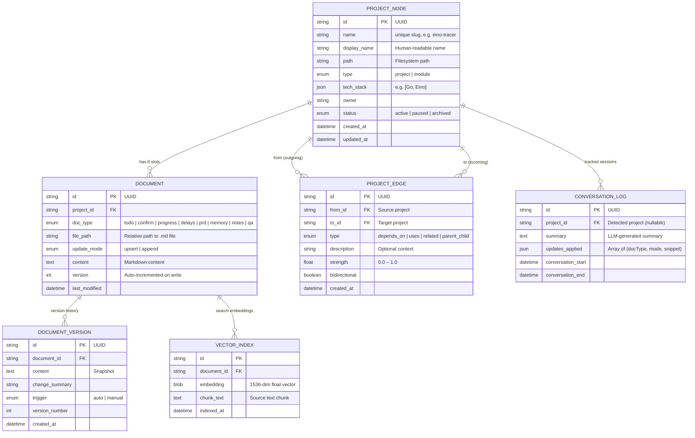

# Project Memory — Knowledge Graph System

## PRD + ERD + Execution & Architecture Workflows

---

## 1. Product Overview

### 1.1 Problem Statement

Current IDE-based AI workflows suffer from three core issues:

- **Context fragmentation**: Each chat session is isolated; no cross-session knowledge persistence.
- **Over-reliance on manual management**: Users must manually summarize, track progress, and maintain project documentation after every conversation.
- **No cross-project awareness**: Related projects (e.g., API layer ↔ RPC layer) have no shared context, leading to duplicated effort and missed dependency changes.

### 1.2 Solution

A **Knowledge Graph–based Project Memory System** that:

- Models projects as **graph nodes**, each containing 8 standardized document types.
- Supports **automatic post-conversation updates** (detect project → classify changes → update docs).
- Enables **manual operations** via MCP tools (`@pm/project/docType`), Web UI, and CLI.
- Introduces **edges** between projects for dependency tracking and cross-project context retrieval.

### 1.3 Target User

Developers managing multiple concurrent projects in Cursor (or similar AI-assisted IDEs) who need persistent, structured, cross-session project memory.

---

## 2. Core Concepts

| Concept | Description |
|---------|-------------|
| **Project Node** | A project or module registered in the graph. Contains metadata + 8 document slots. |
| **Document Slot** | One of 8 standardized document types attached to a project. Each has a default update mode. |
| **Edge** | A typed, directed relationship between two project nodes (dependency, usage, parent-child, related). |
| **Update Mode** | `upsert` (replace by key/section) or `append` (add chronologically). |
| **Auto-Update** | Post-conversation pipeline: detect project → summarize → classify → write documents. |

---

## 3. Document Types (8 Slots per Project)

| # | Slot Key | Name | Default Mode | Key Behavior |
|---|----------|------|-------------|--------------|
| 1 | `todo` | To-Do List | **append** | Date-grouped task items (`- [ ]` / `- [x]`) |
| 2 | `confirm` | Things to Confirm | **upsert** | Keyed by question ID; tracks status (Pending / Confirmed) |
| 3 | `progress` | Current Progress | **upsert** | Keyed by sprint/section; overwrites with latest status |
| 4 | `delays` | Delay Logs | **append** | Chronological entries: reason, impact, mitigation |
| 5 | `prd` | PRD | **upsert** | Keyed by version; full requirement specs |
| 6 | `memory` | Long-term Memories | **append** | Sectioned (Architecture Decisions, Technical Learnings, etc.) |
| 7 | `notes` | Notable Points | **append** | Quick date-stamped observations |
| 8 | `qa` | Questions & Answers | **upsert** | Keyed by question; includes code snippets and tags |

---

## 4. Entity Relationship Diagram (ERD)



### 4.1 Relationship Summary

| Relationship | Cardinality | Description |
|---|---|---|
| Project → Document | 1 : 8 | Exactly 8 document slots per project |
| Project → Edge | M : N | Projects can have multiple edges to/from other projects |
| Document → Version | 1 : N | Every write creates a version snapshot |
| Document → Vector | 1 : N | Content chunked and embedded for semantic search |
| Project → ConversationLog | 1 : N | Logs of auto-update sessions |

---

## 5. Architecture Workflow

### 5.1 System Architecture

```
┌─────────────────────────────────────────────────────────┐
│                      Cursor IDE                          │
│   Chat  │  Composer  │  Terminal  │  @pm commands        │
└────────────────────┬────────────────────────────────────┘
                     │ MCP Protocol (stdio)
                     ▼
┌─────────────────────────────────────────────────────────┐
│           Project Memory MCP Server (Node.js)            │
│                                                          │
│  ┌────────────┐  ┌──────────────┐  ┌─────────────────┐ │
│  │ MCP Tools  │  │  Automation   │  │  Graph Engine   │ │
│  │            │  │  Engine       │  │                 │ │
│  │ • search   │  │ • detector   │  │ • BFS traversal │ │
│  │ • update   │  │ • classifier │  │ • edge CRUD     │ │
│  │ • create   │  │ • watcher    │  │ • context merge │ │
│  │ • context  │  │ • batch proc │  │                 │ │
│  │ • deps     │  │              │  │                 │ │
│  └────────────┘  └──────────────┘  └─────────────────┘ │
│                          │                               │
└──────────────────────────┼───────────────────────────────┘
                           ▼
┌─────────────────────────────────────────────────────────┐
│                   Storage Layer                          │
│                                                          │
│  SQLite (graph.db)          Document Store (.md files)   │
│  • project_nodes            • {project}/.pm/todo.md      │
│  • project_edges            • {project}/.pm/progress.md  │
│  • conversation_logs        • ... (8 files per project)  │
│  • document_versions                                     │
│                                                          │
│  sqlite-vec (vectors)       Config                       │
│  • vector_index             • ~/.project-memory/config   │
└─────────────────────────────────────────────────────────┘
                           │
                           ▼ (optional)
┌─────────────────────────────────────────────────────────┐
│              Web UI (localhost:3000)                      │
│  • D3.js force-directed graph view                       │
│  • Monaco editor for documents                           │
│  • Drag-and-drop dependency manager                      │
└─────────────────────────────────────────────────────────┘
```

### 5.2 Component Responsibilities

| Component | Responsibility |
|---|---|
| **MCP Tools Layer** | Expose 6 tools to Cursor: `pm_search`, `pm_update`, `pm_auto_update`, `pm_project_context`, `pm_project_create`, `pm_dependency_add` |
| **Automation Engine** | Detect project from cwd/content → Summarize conversation via LLM → Classify into doc types → Batch write |
| **Graph Engine** | CRUD for nodes/edges, BFS/DFS traversal, context aggregation across related projects |
| **Storage Layer** | SQLite for structured data + sqlite-vec for embeddings + filesystem for .md documents |
| **Web UI** | Visual graph management, document editing, dependency wiring |

---

## 6. Execution Workflows

### 6.1 Project Initialization

```
User triggers "init project"
       │
       ▼
┌──────────────────┐
│ pm_project_create │
│ (MCP / CLI / UI) │
└────────┬─────────┘
         │
         ▼
┌──────────────────────────────┐
│ 1. Validate name uniqueness  │
│ 2. Create PROJECT_NODE row   │
│ 3. Create .pm/ directory     │
│ 4. Generate 8 .md templates  │
│ 5. Create DOCUMENT rows (×8) │
│ 6. Return confirmation       │
└──────────────────────────────┘
```

### 6.2 Automatic Post-Conversation Update (Core Flow)

```
Conversation in Cursor ends (5 min inactivity)
       │
       ▼
┌──────────────────────────┐
│  Watcher detects silence │
└──────────┬───────────────┘
           ▼
┌──────────────────────────┐     ┌──────────────────────┐
│  Project Detector        │────▶│ Strategy:            │
│                          │     │ 1. Match by cwd path │
│  Input: cwd + chat text  │     │ 2. Keyword extraction│
│  Output: ProjectNode     │     │ 3. Vector similarity │
└──────────┬───────────────┘     └──────────────────────┘
           │
           ▼ (project found?)
       ┌───┴───┐
       │  No   │──▶ Log & skip
       └───┬───┘
           │ Yes
           ▼
┌──────────────────────────┐
│  Conversation Summarizer │
│  (Claude API call)       │
│  Input: chat history     │
│  Output: summary text    │
└──────────┬───────────────┘
           ▼
┌──────────────────────────┐
│  Update Classifier       │
│  (Claude API call)       │
│  Input: summary          │
│  Output: Array of        │
│  {docType, mode, content,│
│   metadata}              │
└──────────┬───────────────┘
           ▼
┌──────────────────────────┐
│  Batch Writer            │
│  For each classified     │
│  update:                 │
│  ├─ append → add to end  │
│  └─ upsert → find key,   │
│     replace or insert    │
│                          │
│  Also:                   │
│  • Create DOCUMENT_VERSION│
│  • Update VECTOR_INDEX   │
│  • Log CONVERSATION_LOG  │
└──────────┬───────────────┘
           ▼
┌──────────────────────────┐
│  Notify user (optional)  │
│  "Updated 3 docs for     │
│   eino-tracer"           │
└──────────────────────────┘
```

### 6.3 Manual Document Update

```
User: @pm/eino-tracer/todo append "Implement caching layer"
       │
       ▼
┌──────────────────────────┐
│  pm_update tool called   │
│  projectId: eino-tracer  │
│  docType: todo           │
│  mode: append            │
│  content: "..."          │
└──────────┬───────────────┘
           ▼
┌──────────────────────────┐
│ 1. Resolve project by    │
│    name → get node       │
│ 2. Load document file    │
│ 3. Apply mode:           │
│    append → concat       │
│    upsert → match key,   │
│            replace block │
│ 4. Write file            │
│ 5. Bump version          │
│ 6. Re-index vectors      │
│ 7. Return confirmation   │
└──────────────────────────┘
```

### 6.4 Cross-Project Context Retrieval

```
User: @pm/api-service context (includeRelated=true, maxDepth=1)
       │
       ▼
┌──────────────────────────────────────┐
│  pm_project_context tool             │
│  projectId: api-service              │
│  includeRelated: true                │
│  maxDepth: 1                         │
└──────────┬───────────────────────────┘
           ▼
┌──────────────────────────────────────┐
│  Graph Engine: BFS Traversal         │
│                                      │
│  Depth 0: api-service                │
│    ├─ Load all 8 documents           │
│    ├─ Get outgoing edges             │
│    │   └─ depends_on → rpc-service   │
│    └─ Get incoming edges             │
│        └─ uses ← frontend-app       │
│                                      │
│  Depth 1: rpc-service               │
│    └─ Load all 8 documents           │
│  Depth 1: frontend-app              │
│    └─ Load all 8 documents           │
└──────────┬───────────────────────────┘
           ▼
┌──────────────────────────────────────┐
│  Context Aggregator                  │
│                                      │
│  Merge into single context:          │
│  • Main project: full docs           │
│  • Related projects: summary of      │
│    progress, recent changes, PRD     │
│  • Edges: dependency descriptions    │
│  • Alerts: breaking changes in deps  │
└──────────┬───────────────────────────┘
           ▼
  Return merged context to Cursor
  (injected into conversation)
```

### 6.5 Semantic Search Across Projects

```
User: @pm search "nil pointer handling"
       │
       ▼
┌──────────────────────────────────────┐
│  pm_search tool                      │
│  query: "nil pointer handling"       │
│  scope: all projects (or filtered)   │
└──────────┬───────────────────────────┘
           ▼
┌──────────────────────────────────────┐
│ 1. Embed query → 1536-dim vector     │
│ 2. sqlite-vec: cosine similarity     │
│    across all VECTOR_INDEX rows      │
│ 3. Rank results by score             │
│ 4. Group by project + docType        │
│ 5. Return top-K with snippets        │
└──────────────────────────────────────┘
```

---

## 7. MCP Tool Definitions

| Tool | Input | Output | Description |
|------|-------|--------|-------------|
| `pm_project_create` | `name`, `path`, `techStack`, `parentId?` | Project node + confirmation | Initialize a new project with 8 document templates |
| `pm_update` | `projectId`, `docType`, `content`, `mode?`, `metadata?` | Updated document | Manually update a specific document (upsert or append) |
| `pm_auto_update` | `conversationSummary`, `projectId?` | List of updates applied | Auto-classify and batch-update documents from conversation |
| `pm_project_context` | `projectId`, `includeRelated?`, `maxDepth?` | Merged context (all docs + related) | Get full project context for conversation injection |
| `pm_search` | `query`, `projectId?`, `docTypes?`, `includeRelated?` | Ranked search results | Semantic search across documents and projects |
| `pm_dependency_add` | `fromId`, `toId`, `type`, `description?` | Edge confirmation | Create a directed dependency between two projects |

---

## 8. Update Mode Logic

### 8.1 Append Mode

```
Existing content:
  ## 2025-02-09
  - [x] Fix nil pointer

New content (append):
  ## 2025-02-10
  - [ ] Implement caching

Result:
  ## 2025-02-09
  - [x] Fix nil pointer

  ## 2025-02-10
  - [ ] Implement caching
```

### 8.2 Upsert Mode

```
Existing content:
  ## Q1: Use subgraph or parallel?
  **Status:** Pending

New content (upsert, key=Q1):
  ## Q1: Use subgraph or parallel?
  **Status:** Confirmed
  **Decision:** Subgraph

Result:
  ## Q1: Use subgraph or parallel?
  **Status:** Confirmed
  **Decision:** Subgraph
```

Upsert matching strategy by doc type:

| Doc Type | Match Key |
|---|---|
| `confirm` | Question ID (## Q1, ## Q2, ...) |
| `progress` | Section header (## Current Sprint) |
| `prd` | Version header (## V1.0, ## V2.0) |
| `qa` | Question text (## How to handle X?) |

---

## 9. Tech Stack

| Layer | Technology | Rationale |
|-------|-----------|-----------|
| MCP Server | Node.js + TypeScript | Official MCP SDK support, async-native |
| Structured Storage | SQLite (better-sqlite3) | Zero-config, embedded, fast |
| Vector Search | sqlite-vec | Lightweight, same DB, cosine similarity |
| Embeddings | OpenAI `text-embedding-3-small` | 1536-dim, cost-effective, high quality |
| LLM (classifier) | Claude Sonnet | Conversation summarization + update classification |
| Web UI | React + Vite + Tailwind | Fast dev cycle, hot reload |
| Graph Visualization | D3.js force-directed | Flexible, customizable, interactive |
| Document Editor | Monaco Editor | VS Code parity, markdown support |

---

## 10. MVP Roadmap (4 Weeks)

| Week | Deliverable | Key Tasks |
|------|------------|-----------|
| **W1** | Core storage + basic MCP | SQLite schema, document CRUD, `pm_project_create`, `pm_update`, `pm_search` (keyword-only) |
| **W2** | Automation engine | Project detector (cwd + keyword), LLM classifier, conversation watcher, `pm_auto_update` |
| **W3** | Vector search + graph traversal | sqlite-vec integration, embedding pipeline, `pm_dependency_add`, `pm_project_context` with BFS |
| **W4** | Web UI | D3 graph view, Monaco doc editor, dependency drag-and-drop, search & filter |

### Post-MVP (V2)

- Cross-project alerts (breaking changes in dependencies)
- Git integration (auto-detect project from repo)
- Cursor Rules auto-generation from project memory
- Multi-user support (team shared graph)
- Export to Notion / Obsidian / Markdown vault

---

## 11. Configuration

```jsonc
// ~/.project-memory/config.json
{
  "storage": {
    "dbPath": "~/.project-memory/graph.db",
    "docsRoot": "~/.project-memory/docs/",  // or inline in project .pm/ dir
    "vectorDimension": 1536
  },
  "automation": {
    "enabled": true,
    "inactivityThresholdMs": 300000,
    "classifierModel": "claude-sonnet-4-5-20250929",
    "maxAutoUpdatesPerSession": 5
  },
  "embedding": {
    "provider": "openai",
    "model": "text-embedding-3-small"
  },
  "ui": {
    "enabled": true,
    "port": 3000
  },
  "defaults": {
    "documentModes": {
      "todo": "append",
      "confirm": "upsert",
      "progress": "upsert",
      "delays": "append",
      "prd": "upsert",
      "memory": "append",
      "notes": "append",
      "qa": "upsert"
    }
  }
}
```
